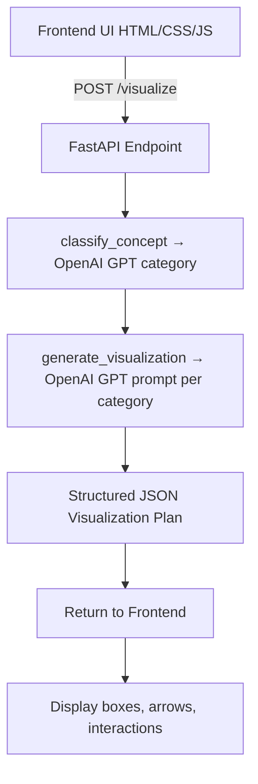

# 🧠 AI Concept Visualizer

> **Turn any concept into an interactive, personalized learning experience — powered by AI.**

## 🚀 What is this?

**AI Concept Visualizer** is an experimental platform that uses AI to generate real-time visual explanations for complex topics. From binary search to the water cycle, this system transforms abstract ideas into **interactive diagrams**, **live code-based simulations**, and **adaptive quizzes** — in seconds.

We’re not digitizing textbooks.  
We’re building a new way to understand the universe.

---

## ✨ Features (MVP)

- 🛠️ **Concept Input**: Enter any concept (e.g. "Binary Search", "Photosynthesis")
- 🧠 **AI-Powered Generation Pipeline**
  - Stage 1: Concept Plan Generator (JSON / Mermaid)
  - Stage 2: HTML/CSS/JS Visualizer Builder
  - Stage 3: Critique & Score (auto-iterates for quality)
- 🎮 **Interactive Visualization Renderer**
- 💬 **Built-in AI Tutor Chat**
- 📝 **AI-Generated Quiz Module**

---

## 🧪 Tech Stack

| Layer       | Stack                                |
|-------------|--------------------------------------|
| Frontend    | React + Next.js + Tailwind + iframe  |
| AI Engine   | GPT-4 / Claude + Prompt Chains       |
| Renderers   | D3.js / Mermaid / Canvas / HTML+CSS  |
| Scoring     | AI-based feedback + retry loop       |
| Hosting     | Vercel or Netlify                    |
| Storage     | Supabase or JSON files (MVP)         |

---

## 🎯 Why This Matters

> “What if you could *learn anything* 10x faster with the help of an infinitely patient, personalized, interactive tutor?”

Education hasn’t evolved much since the printing press.  
This project is our rebellion.

---

## 🧰 Development Status

**Hackathon MVP Goals:**
- [x] User input UI for concept
- [x] Generate & render one full concept (Binary Search / Water Cycle)
- [x] JSON → HTML/CSS/JS pipeline
- [x] Critique scoring loop
- [x] Quiz + AI tutor panel

---

## 🧠 Example Concepts (Try These!)

- `"Binary Search"`
- `"Photosynthesis"`
- `"Supply and Demand"`
- `"How do volcanoes form?"`
- `"Explain recursion"`

---

## 📁 Project Structure

✅ What We’ve Built So Far
1. Backend Architecture (Python + FastAPI)
API Endpoint: /visualize – Accepts a concept string and returns a categorized, structured visualization plan.

Routing Layer:

Receives a POST request with a JSON body: {"concept": "binary search"}

Triggers classification → visualization plan generation → response packaging.

LLM Integration:

Using OpenAI's openai Python SDK.
OpenAI Calls:

Step 1: Classification – Ask GPT to classify the concept into 1 of 15 predefined categories.

Step 2: Visualization Generation – Based on the category, use a tailored prompt to generate a JSON plan.

Category Prompt Mapping:

CATEGORY_PROMPTS dictionary maps 15 academic categories to rich prompts.

Prompts specify expected JSON fields like title, description, elements, interactions, and htmlTips.

2. Data Model Structure (Pydantic)
ConceptRequest: accepts a single field concept: str.

VisualizationElement: each element has label, type, position, description.

VisualizationPlan: includes title, layout, interaction, elements.

ConceptResponse: returns category and the above visualization object.

3. Error Handling & Parsing
Logs each step (classification, prompt, parsing).

Attempts to parse OpenAI output to JSON.

If parsing fails, returns a raw response for debugging.

🛠️ Implementation Details Recap
Input: "binary search"

Output:
{
  "concept": "binary search",
  "category": "Computer Science & Technology",
  "visualization": {
    "title": "Binary Search",
    "description": "A divide-and-conquer algorithm...",
    "layout": "Horizontal array with moving pointers...",
    "interaction": "Pointer movement, animation step-by-step",
    "elements": [
      { "label": "Array", "type": "box", "position": "center", "description": "Sorted list of numbers" },
      ...
    ],
    "htmlTips": "Use JS to animate pointer movement and comparisons"
  }
}
Backend Files:

models/concept.py: Schema definitions.

api/routes.py: API logic, request handler.

utils/llm_utils.py or equivalent: GPT prompt formatting and parsing logic.

🔭 Planned Improvements
📦 Backend:
Improve handling of malformed GPT output (e.g., incomplete JSON).
Add logging, error tags, and timestamps for easier debugging.

🎨 Frontend (coming soon):
Render HTML/CSS/JS-based visualizations from the structured JSON.
Animate interactions: clicking, slider input, step transitions.
Show loading progress and allow retry/fallback if model fails.
